# 数据库脚本结构

<cite>
**本文档引用的文件**  
- [script/mysql/DataStruct.sql](file://script/mysql/DataStruct.sql)
- [script/postgres/datastruct.sql](file://script/postgres/datastruct.sql)
- [script/oracle/DATASTRUCT.sql](file://script/oracle/DATASTRUCT.sql)
- [script/kingbase/datastruct.sql](file://script/kingbase/datastruct.sql)
- [script/tidb/datastruct.sql](file://script/tidb/datastruct.sql)
- [script/db2/DATASTRUCT.sql](file://script/db2/DATASTRUCT.sql)
- [script/mysql/Dashboard.sql](file://script/mysql/Dashboard.sql)
- [script/mysql/proc_DashBoard.sql](file://script/mysql/proc_DashBoard.sql)
- [script/postgres/proc_dashboard.sql](file://script/postgres/proc_dashboard.sql)
- [script/kingbase/proc_dashboard.sql](file://script/kingbase/proc_dashboard.sql)
- [script/oracle/PROC_DASHBOARD.sql](file://script/oracle/PROC_DASHBOARD.sql)
- [script/postgres/inituserdb.sql](file://script/postgres/inituserdb.sql)
- [script/kingbase/inituserdb.sql](file://script/kingbase/inituserdb.sql)
- [script/postgres/pgcron.sql](file://script/postgres/pgcron.sql)
- [script/postgres/mysql_fdw.sql](file://script/postgres/mysql_fdw.sql)
- [script/postgres/dts.sql](file://script/postgres/dts.sql)
- [script/kingbase/dts.sql](file://script/kingbase/dts.sql)
- [script/mysql/ev_DashBoard.sql](file://script/mysql/ev_DashBoard.sql)
- [script/kingbase/ev_DashBoard.sql](file://script/kingbase/ev_DashBoard.sql)
</cite>

## 目录

1. [引言](#引言)
2. [脚本目录结构](#脚本目录结构)
3. [各数据库表结构脚本对比](#各数据库表结构脚本对比)
4. [存储过程脚本实现差异](#存储过程脚本实现差异)
5. [用户数据库初始化流程](#用户数据库初始化流程)
6. [高级特性脚本应用场景](#高级特性脚本应用场景)
7. [触发器与事件脚本机制](#触发器与事件脚本机制)
8. [跨平台部署执行指南](#跨平台部署执行指南)
9. [结论](#结论)

## 引言

本项目通过 `script/` 目录下的多数据库兼容SQL脚本体系，支持MySQL、PostgreSQL、Oracle、Kingbase、TiDB、DB2等多种数据库系统。该设计旨在实现核心数据模型与业务逻辑在不同数据库平台间的无缝迁移与部署。本文将系统性解析该脚本体系的结构、功能差异及部署策略，为数据库管理员提供全面的技术参考。

## 脚本目录结构

`script/` 目录按数据库类型组织子目录，每个子目录包含针对该数据库的专用SQL脚本。主要子目录包括 `mysql/`、`postgres/`、`oracle/`、`kingbase/`、`tidb/`、`db2/`，分别对应不同数据库的DDL与DML脚本。此外，`watch/` 和 `eadm/` 等目录存放辅助配置文件，而 `sec.erl` 为Erlang安全模块。

**目录结构示意图**

```mermaid
graph TB
Script[script/] --> MySQL[mysql/]
Script --> Postgres[postgres/]
Script --> Oracle[oracle/]
Script --> Kingbase[kingbase/]
Script --> TiDB[tidb/]
Script --> DB2[db2/]
Script --> Watch[watch/]
Script --> EADM[eadm/]
MySQL --> DataStructMySQL[DataStruct.sql]
MySQL --> DashboardSQL[Dashboard.sql]
MySQL --> ProcDash[proc_DashBoard.sql]
MySQL --> EvDash[ev_DashBoard.sql]
Postgres --> DataStructPG[datastruct.sql]
Postgres --> ProcDashPG[proc_dashboard.sql]
Postgres --> InitUser[inituserdb.sql]
Postgres --> PGCron[pgcron.sql]
Postgres --> MySQLFDW[mysql_fdw.sql]
Postgres --> DTS[dts.sql]
Kingbase --> DataStructKB[datastruct.sql]
Kingbase --> ProcDashKB[proc_dashboard.sql]
Kingbase --> InitUserKB[inituserdb.sql]
Kingbase --> DTSKB[dts.sql]
Kingbase --> EvDashKB[ev_DashBoard.sql]
Oracle --> DataStructOR[DATASTRUCT.sql]
Oracle --> DBInit[DBINIT.sql]
Oracle --> ProcDashOR[PROC_DASHBOARD.sql]
TiDB --> DataStructTiDB[datastruct.sql]
DB2 --> DataStructDB2[DATASTRUCT.sql]
```

**Diagram sources**  
- [script/mysql/DataStruct.sql](file://script/mysql/DataStruct.sql)
- [script/postgres/datastruct.sql](file://script/postgres/datastruct.sql)
- [script/oracle/DATASTRUCT.sql](file://script/oracle/DATASTRUCT.sql)
- [script/kingbase/datastruct.sql](file://script/kingbase/datastruct.sql)
- [script/tidb/datastruct.sql](file://script/tidb/datastruct.sql)
- [script/db2/DATASTRUCT.sql](file://script/db2/DATASTRUCT.sql)

## 各数据库表结构脚本对比

各数据库子目录中的表结构定义脚本（如 `DataStruct.sql`）实现了相同的核心数据模型，但在语法细节上存在差异：

- **命名规范**：MySQL、PostgreSQL、Kingbase 使用小写文件名 `datastruct.sql`，而 Oracle 和 DB2 使用大写 `DATASTRUCT.sql`，反映其对大小写敏感性的不同处理。
- **数据类型映射**：
  - MySQL 使用 `DATETIME`、`VARCHAR` 等类型
  - PostgreSQL 使用 `TIMESTAMP`、`TEXT` 等类型
  - Oracle 使用 `DATE`、`VARCHAR2` 等类型
  - Kingbase 和 TiDB 兼容各自参照的数据库（PostgreSQL/MySQL）
- **约束定义**：主键、外键、唯一约束的语法基本一致，但索引创建语句在不同数据库中略有差异。
- **扩展特性**：PostgreSQL 脚本可能包含 `JSONB` 字段，Oracle 可能使用 `CLOB`，而 TiDB 脚本需考虑分布式主键策略。

尽管存在语法差异，所有脚本均保证了表结构的语义一致性，确保应用层无需修改即可适配不同数据库。

**Section sources**  
- [script/mysql/DataStruct.sql](file://script/mysql/DataStruct.sql)
- [script/postgres/datastruct.sql](file://script/postgres/datastruct.sql)
- [script/oracle/DATASTRUCT.sql](file://script/oracle/DATASTRUCT.sql)
- [script/kingbase/datastruct.sql](file://script/kingbase/datastruct.sql)
- [script/tidb/datastruct.sql](file://script/tidb/datastruct.sql)
- [script/db2/DATASTRUCT.sql](file://script/db2/DATASTRUCT.sql)

## 存储过程脚本实现差异

`proc_dashboard.sql` 等存储过程脚本在不同数据库中的实现体现了各自的过程化语言特性：

- **命名与大小写**：MySQL 使用 `proc_DashBoard.sql`（驼峰命名），而 PostgreSQL、Kingbase 使用 `proc_dashboard.sql`（小写），Oracle 使用 `PROC_DASHBOARD.sql`（全大写）。
- **语言语法**：
  - MySQL 使用 `DELIMITER` 定义结束符，过程体以 `BEGIN...END` 包裹
  - PostgreSQL 使用 `plpgsql` 语言，支持更复杂的控制结构
  - Oracle 使用 `PL/SQL`，语法更为严格，需声明 `IS` 或 `AS`
- **功能等价性**：各版本 `proc_dashboard` 均实现仪表盘数据聚合逻辑，但游标处理、异常捕获等机制因数据库而异。
- **权限控制**：Oracle 和 Kingbase 脚本可能包含更细粒度的 `GRANT` 语句。

这些差异要求在跨平台部署时，必须使用对应数据库的存储过程脚本，不可混用。

**Section sources**  
- [script/mysql/proc_DashBoard.sql](file://script/mysql/proc_DashBoard.sql)
- [script/postgres/proc_dashboard.sql](file://script/postgres/proc_dashboard.sql)
- [script/kingbase/proc_dashboard.sql](file://script/kingbase/proc_dashboard.sql)
- [script/oracle/PROC_DASHBOARD.sql](file://script/oracle/PROC_DASHBOARD.sql)

## 用户数据库初始化流程

`inituserdb.sql` 脚本负责用户数据库的初始化，主要存在于 `postgres/` 和 `kingbase/` 目录中。其执行流程如下：

1. **连接数据库**：以管理员身份连接目标数据库实例
2. **创建用户与角色**：定义应用专用数据库用户，并赋予适当角色
3. **创建模式（Schema）**：为应用创建独立的命名空间
4. **授权访问**：授予用户对相关模式和对象的操作权限
5. **设置默认配置**：初始化系统参数、时区、字符集等

该脚本是部署流程的起点，必须在执行 `datastruct.sql` 前运行，以确保后续DDL操作的执行主体已正确配置。

**Section sources**  
- [script/postgres/inituserdb.sql](file://script/postgres/inituserdb.sql)
- [script/kingbase/inituserdb.sql](file://script/kingbase/inituserdb.sql)

## 高级特性脚本应用场景

### pgcron.sql
位于 `postgres/` 目录，用于在PostgreSQL中安装和配置 `pg_cron` 扩展。该扩展允许在数据库内部调度周期性任务（如数据归档、统计计算），替代外部cron作业，提高任务执行的可靠性和一致性。

### mysql_fdw.sql
位于 `postgres/` 目录，用于配置 `mysql_fdw` 外部数据包装器。通过此脚本，PostgreSQL 可以直接查询和操作远程MySQL数据库中的表，实现异构数据库间的无缝数据集成，适用于数据迁移、联合查询等场景。

**Section sources**  
- [script/postgres/pgcron.sql](file://script/postgres/pgcron.sql)
- [script/postgres/mysql_fdw.sql](file://script/postgres/mysql_fdw.sql)

## 触发器与事件脚本机制

### dts.sql
存在于 `postgres/` 和 `kingbase/` 目录，定义数据变更触发器（Triggers）。这些触发器通常在关键表（如用户、设备）的 `INSERT`、`UPDATE`、`DELETE` 操作时自动执行，用于：
- 记录操作日志到审计表
- 维护衍生数据（如统计计数）
- 实施复杂业务规则校验

### ev_DashBoard.sql
存在于 `mysql/` 和 `kingbase/` 目录，定义数据库事件（Events）。这些事件按预设时间间隔自动执行（如每小时），用于：
- 刷新仪表盘缓存数据
- 执行定时聚合计算
- 清理临时数据

与存储过程不同，事件是时间驱动的自动化任务，减轻应用层调度负担。

**Section sources**  
- [script/postgres/dts.sql](file://script/postgres/dts.sql)
- [script/kingbase/dts.sql](file://script/kingbase/dts.sql)
- [script/mysql/ev_DashBoard.sql](file://script/mysql/ev_DashBoard.sql)
- [script/kingbase/ev_DashBoard.sql](file://script/kingbase/ev_DashBoard.sql)

## 跨平台部署执行指南

为确保多数据库环境的正确部署，请遵循以下指南：

### 初始化顺序
1. 执行 `inituserdb.sql`（如可用）创建用户和权限
2. 执行对应数据库的 `datastruct.sql` 创建表结构
3. 执行 `proc_dashboard.sql` 等存储过程脚本
4. 执行 `dts.sql` 或 `ev_DashBoard.sql` 配置触发器或事件
5. （PostgreSQL专属）执行 `pgcron.sql` 和 `mysql_fdw.sql` 启用高级特性

### 依赖关系
- `proc_dashboard.sql` 依赖 `datastruct.sql` 中定义的表
- `dts.sql` 依赖被监控的业务表
- `mysql_fdw.sql` 依赖已运行的MySQL实例和网络连通性

### 版本适配注意事项
- **语法兼容性**：避免使用特定数据库的专有语法
- **数据类型映射**：确保应用层能正确处理各数据库的类型差异
- **字符集与排序规则**：统一设置为 `UTF-8` 和通用排序规则
- **权限模型**：根据目标数据库的权限体系调整 `GRANT` 语句
- **工具链适配**：使用对应数据库的客户端工具（如 `psql`、`sqlplus`、`isql`）执行脚本

**Section sources**  
- [script/postgres/inituserdb.sql](file://script/postgres/inituserdb.sql)
- [script/kingbase/inituserdb.sql](file://script/kingbase/inituserdb.sql)
- [script/mysql/DataStruct.sql](file://script/mysql/DataStruct.sql)
- [script/postgres/datastruct.sql](file://script/postgres/datastruct.sql)
- [script/oracle/DATASTRUCT.sql](file://script/oracle/DATASTRUCT.sql)
- [script/kingbase/datastruct.sql](file://script/kingbase/datastruct.sql)
- [script/tidb/datastruct.sql](file://script/tidb/datastruct.sql)
- [script/db2/DATASTRUCT.sql](file://script/db2/DATASTRUCT.sql)
- [script/mysql/proc_DashBoard.sql](file://script/mysql/proc_DashBoard.sql)
- [script/postgres/proc_dashboard.sql](file://script/postgres/proc_dashboard.sql)
- [script/kingbase/proc_dashboard.sql](file://script/kingbase/proc_dashboard.sql)
- [script/oracle/PROC_DASHBOARD.sql](file://script/oracle/PROC_DASHBOARD.sql)
- [script/postgres/dts.sql](file://script/postgres/dts.sql)
- [script/kingbase/dts.sql](file://script/kingbase/dts.sql)
- [script/mysql/ev_DashBoard.sql](file://script/mysql/ev_DashBoard.sql)
- [script/kingbase/ev_DashBoard.sql](file://script/kingbase/ev_DashBoard.sql)
- [script/postgres/pgcron.sql](file://script/postgres/pgcron.sql)
- [script/postgres/mysql_fdw.sql](file://script/postgres/mysql_fdw.sql)

## 结论

`script/` 目录下的多数据库SQL脚本体系通过分库分治的策略，实现了对MySQL、PostgreSQL、Oracle、Kingbase、TiDB、DB2等主流数据库的兼容支持。各子目录的脚本在保证核心数据模型一致的前提下，充分适配了各数据库的语法特性和最佳实践。通过遵循推荐的部署流程和注意事项，数据库管理员可以高效、可靠地完成跨平台系统的初始化与配置，为上层应用提供稳定的数据服务支撑。