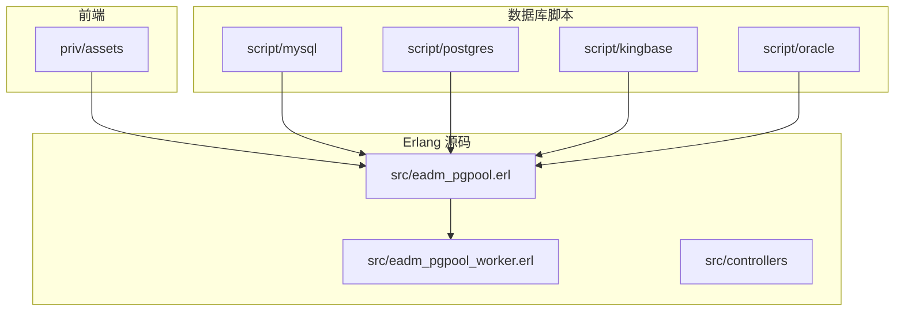
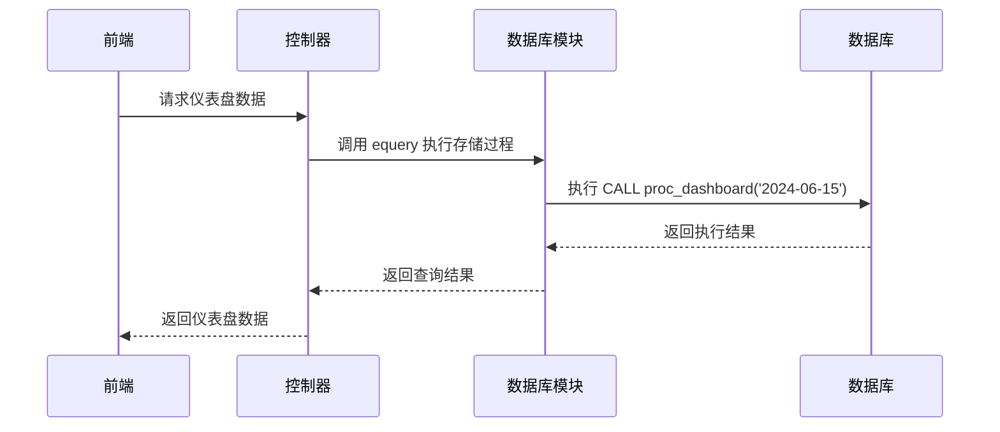
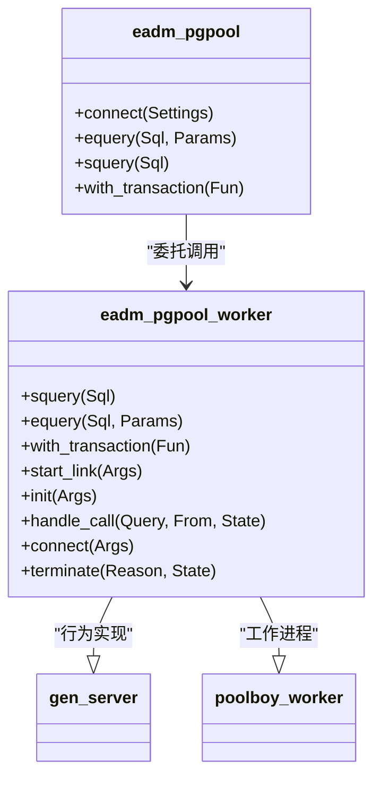
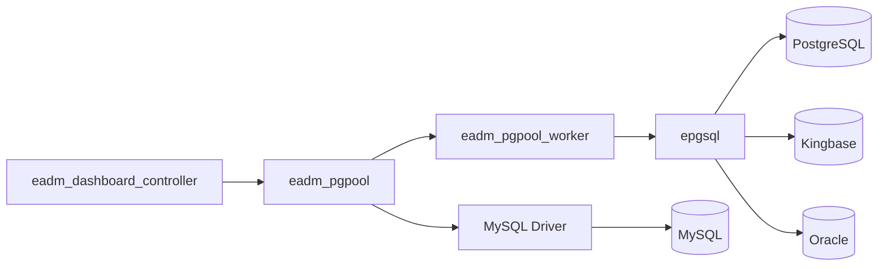

# 存储过程实现

<cite>
**本文档引用的文件**  
- [proc_dashboard.sql](file://script/kingbase/proc_dashboard.sql)
- [proc_dashboard.sql](file://script/postgres/proc_dashboard.sql)
- [PROC_DASHBOARD.sql](file://script/oracle/PROC_DASHBOARD.sql)
- [proc_DashBoard.sql](file://script/mysql/proc_DashBoard.sql)
- [eadm_pgpool_worker.erl](file://src/eadm_pgpool_worker.erl)
- [eadm_pgpool.erl](file://src/eadm_pgpool.erl)
</cite>

## 目录
1. [引言](#引言)
2. [项目结构](#项目结构)
3. [核心组件](#核心组件)
4. [架构概述](#架构概述)
5. [详细组件分析](#详细组件分析)
6. [依赖分析](#依赖分析)
7. [性能考虑](#性能考虑)
8. [故障排除指南](#故障排除指南)
9. [结论](#结论)

## 引言
本项目是一个基于Erlang的后端系统，支持多数据库平台（Kingbase、PostgreSQL、Oracle、MySQL等），通过统一接口调用各数据库中的`proc_dashboard`存储过程，用于生成仪表盘数据。该存储过程负责聚合用户健康、财务、设备等多维度数据，并进行统计计算与状态汇总。不同数据库平台的SQL语法存在差异，但功能一致。系统通过Erlang模块封装数据库连接与调用逻辑，实现跨平台兼容性。

## 项目结构
项目采用分层结构，前端资源位于`priv/assets`，数据库脚本按数据库类型分类存放于`script/`目录下，Erlang源码位于`src/`目录。核心数据库操作由`eadm_pgpool`和`eadm_pgpool_worker`模块实现，通过`poolboy`管理数据库连接池。仪表盘数据生成依赖各数据库平台的`proc_dashboard`存储过程。

**图示来源**  
- [script/mysql/proc_DashBoard.sql](file://script/mysql/proc_DashBoard.sql)
- [script/postgres/proc_dashboard.sql](file://script/postgres/proc_dashboard.sql)
- [src/eadm_pgpool.erl](file://src/eadm_pgpool.erl)
- [src/eadm_pgpool_worker.erl](file://src/eadm_pgpool_worker.erl)

**本节来源**  
- [script/mysql/proc_DashBoard.sql](file://script/mysql/proc_DashBoard.sql)
- [script/postgres/proc_dashboard.sql](file://script/postgres/proc_dashboard.sql)
- [script/kingbase/proc_dashboard.sql](file://script/kingbase/proc_dashboard.sql)
- [script/oracle/PROC_DASHBOARD.sql](file://script/oracle/PROC_DASHBOARD.sql)
- [src/eadm_pgpool.erl](file://src/eadm_pgpool.erl)

## 核心组件
核心组件包括各数据库平台的`proc_dashboard`存储过程，以及Erlang中的数据库连接池管理模块。存储过程负责清空临时表`eadm_dashboard`，设置时区，计算周/年平均心率、步数、睡眠、里程，以及月度收入与支出，并将结果写入日志表`sys_proclog`。Erlang模块通过`epgsql`驱动执行存储过程调用。

**本节来源**  
- [script/kingbase/proc_dashboard.sql](file://script/kingbase/proc_dashboard.sql#L1-L210)
- [script/postgres/proc_dashboard.sql](file://script/postgres/proc_dashboard.sql#L1-L207)
- [script/oracle/PROC_DASHBOARD.sql](file://script/oracle/PROC_DASHBOARD.sql#L1-L208)
- [script/mysql/proc_DashBoard.sql](file://script/mysql/proc_DashBoard.sql#L1-L213)
- [src/eadm_pgpool_worker.erl](file://src/eadm_pgpool_worker.erl#L1-L246)

## 架构概述
系统采用分层架构，前端通过HTTP请求触发控制器，控制器调用Erlang数据库模块执行存储过程。数据库模块通过连接池管理与各数据库的连接，确保高并发下的性能与稳定性。存储过程在数据库内部完成复杂的数据聚合与计算，减少网络传输开销。

**图示来源**  
- [src/eadm_pgpool_worker.erl](file://src/eadm_pgpool_worker.erl#L75-L116)
- [script/postgres/proc_dashboard.sql](file://script/postgres/proc_dashboard.sql#L1-L207)

## 详细组件分析

### 存储过程逻辑分析
各数据库平台的`proc_dashboard`存储过程实现相同功能，但语法略有差异。主要逻辑包括：

1. **初始化**：清空`eadm_dashboard`表，设置时区为`Asia/Shanghai`。
2. **周/年统计**：通过`INTERVAL`或`DATE_ADD`计算时间范围，使用`AVG`、`SUM`、`MAX`、`MIN`等聚合函数计算平均值或差值。
3. **月度数据填充**：先插入12个月的占位记录，再通过`UPDATE ... FROM`（PostgreSQL/Kingbase/Oracle）或`UPDATE ... JOIN`（MySQL）更新实际值。
4. **异常处理**：使用`BEGIN...END`块（MySQL）或`EXCEPTION WHEN OTHERS THEN`（PL/pgSQL）捕获异常，记录错误日志并回滚事务。
5. **日志记录**：无论成功或失败，均向`sys_proclog`表插入执行时间、结果、错误码和消息。

#### SQL语法差异对比
| 特性 | PostgreSQL/Kingbase/Oracle (PL/pgSQL) | MySQL |
|------|----------------------------------------|-------|
| 存储过程定义 | `CREATE OR REPLACE PROCEDURE ... LANGUAGE plpgsql` | `CREATE PROCEDURE ... BEGIN ... END` |
| 参数模式 | 支持 `IN`, `OUT`, `INOUT` | 仅支持 `IN`（默认） |
| 变量声明 | `DECLARE var_name type := value;` | `DECLARE var_name type DEFAULT value;` |
| 异常处理 | `EXCEPTION WHEN others THEN ...` | `DECLARE CONTINUE HANDLER FOR SQLEXCEPTION ...` |
| 事务控制 | `COMMIT;` / `ROLLBACK;` | `START TRANSACTION;` / `COMMIT;` / `ROLLBACK;` |
| 类型转换 | `column::int` 或 `CAST(column AS int)` | `CAST(column AS SIGNED)` 或直接使用 |
| 日期函数 | `indate - INTERVAL '7 days'` | `DATE_ADD(indate, INTERVAL -7 DAY)` |
| 空值处理 | `NULLIF(value, 0)` | `IFNULL(value, 0)` |

**图示来源**  
- [script/postgres/proc_dashboard.sql](file://script/postgres/proc_dashboard.sql#L1-L207)
- [script/mysql/proc_DashBoard.sql](file://script/mysql/proc_DashBoard.sql#L1-L213)

**本节来源**  
- [script/postgres/proc_dashboard.sql](file://script/postgres/proc_dashboard.sql#L1-L207)
- [script/mysql/proc_DashBoard.sql](file://script/mysql/proc_DashBoard.sql#L1-L213)
- [script/kingbase/proc_dashboard.sql](file://script/kingbase/proc_dashboard.sql#L1-L210)
- [script/oracle/PROC_DASHBOARD.sql](file://script/oracle/PROC_DASHBOARD.sql#L1-L208)

### Erlang数据库调用分析
Erlang通过`eadm_pgpool`和`eadm_pgpool_worker`模块封装数据库操作。`eadm_pgpool_worker`作为`poolboy`的工作进程，管理数据库连接的生命周期。`equery/4`函数用于执行带参数的SQL语句，支持连接池和超时设置。存储过程调用通过`equery`发送`CALL proc_dashboard('2024-06-15')`语句实现。

**图示来源**  
- [src/eadm_pgpool.erl](file://src/eadm_pgpool.erl#L1-L147)
- [src/eadm_pgpool_worker.erl](file://src/eadm_pgpool_worker.erl#L1-L246)

**本节来源**  
- [src/eadm_pgpool.erl](file://src/eadm_pgpool.erl#L1-L147)
- [src/eadm_pgpool_worker.erl](file://src/eadm_pgpool_worker.erl#L1-L246)

## 依赖分析
系统依赖`epgsql` Erlang PostgreSQL客户端库和`poolboy`连接池库。各数据库平台的存储过程依赖特定的表结构（如`lc_watchdaily`、`lc_carlocdaily`、`fn_paybilldetail`）。Erlang控制器模块依赖`eadm_pgpool`进行数据库操作。

**图示来源**  
- [src/eadm_pgpool.erl](file://src/eadm_pgpool.erl#L67-L102)
- [src/eadm_pgpool_worker.erl](file://src/eadm_pgpool_worker.erl#L153-L193)

**本节来源**  
- [src/eadm_pgpool.erl](file://src/eadm_pgpool.erl#L1-L147)
- [src/eadm_pgpool_worker.erl](file://src/eadm_pgpool_worker.erl#L1-L246)

## 性能考虑
- **连接池**：使用`poolboy`管理连接，避免频繁创建/销毁连接的开销。
- **数据库内计算**：将聚合计算放在数据库端执行，减少数据传输量。
- **索引优化**：确保`ptime`、`deviceno`、`tradetime`等字段有适当索引以加速查询。
- **事务隔离**：MySQL中设置`READ UNCOMMITTED`隔离级别以减少锁竞争，但需注意脏读风险。
- **批量操作**：月度数据通过单条`INSERT ... VALUES`插入多行，提高效率。

## 故障排除指南
### 常见错误及修复方案
| 错误现象 | 可能原因 | 修复方案 |
|---------|--------|--------|
| 存储过程不存在 | 数据库未正确初始化 | 执行对应数据库的`proc_dashboard.sql`脚本创建过程 |
| 参数不匹配 | 调用时参数类型或数量错误 | 检查调用语句，确保日期格式为`'YYYY-MM-DD'`字符串 |
| 表不存在 | 数据结构未初始化 | 执行`DATASTRUCT.sql`或`datastruct.sql`创建表 |
| 权限不足 | 数据库用户无执行存储过程权限 | 授予用户`EXECUTE`权限 |
| 连接失败 | 数据库服务未启动或配置错误 | 检查`epgsql`连接参数（host, port, db, user, pass） |
| 聚合结果为NULL | 源表无符合条件的数据 | 检查`lc_watchdaily`等源表是否有足够数据 |

### 调试方法
1. **日志输出**：检查`sys_proclog`表中的`errcode`和`errmessage`字段定位错误。
2. **直接执行**：在数据库客户端手动执行`CALL proc_dashboard('2024-06-15');`观察输出。
3. **分步调试**：将存储过程拆分为多个独立SQL语句，逐条执行以定位问题。
4. **Erlang日志**：查看`error_logger`输出的连接和查询日志。

**本节来源**  
- [script/postgres/proc_dashboard.sql](file://script/postgres/proc_dashboard.sql#L200-L207)
- [script/mysql/proc_DashBoard.sql](file://script/mysql/proc_DashBoard.sql#L200-L213)
- [src/eadm_pgpool_worker.erl](file://src/eadm_pgpool_worker.erl#L190-L229)

## 结论
`proc_dashboard`存储过程是系统仪表盘功能的核心，实现了跨平台的数据聚合与统计。尽管各数据库SQL语法存在差异，但通过统一的Erlang接口调用，实现了良好的封装性和可维护性。建议在部署时确保数据库脚本正确执行，并监控`sys_proclog`以及时发现和解决问题。