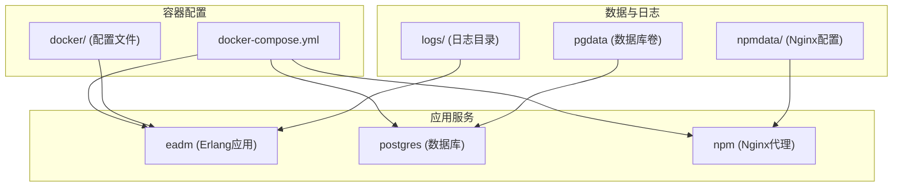
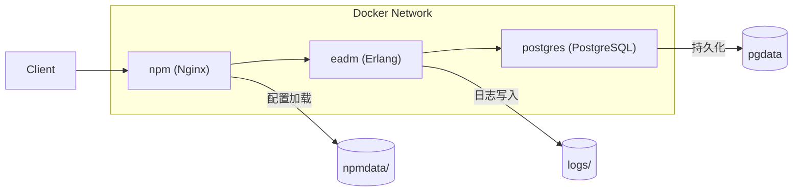
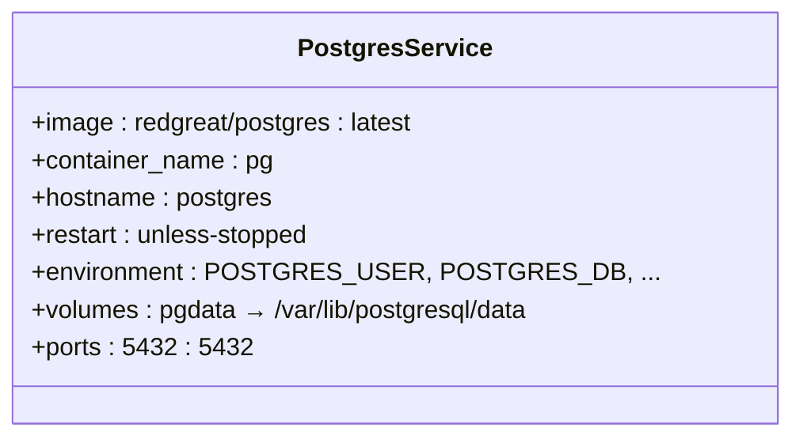
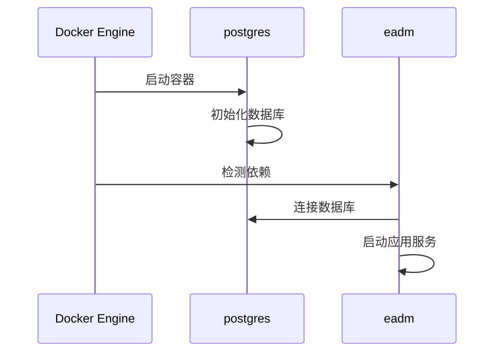
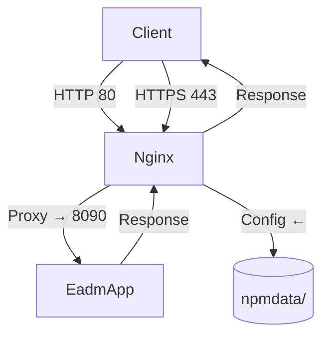
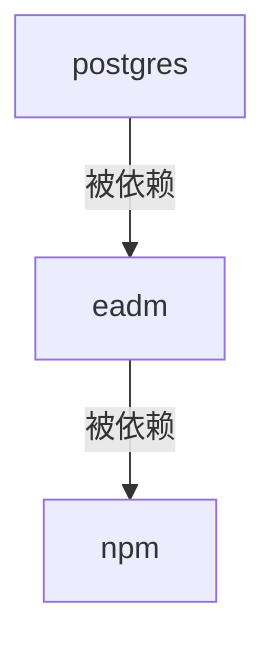

# Docker Compose服务编排

<cite>
**本文档引用文件**  
- [docker-compose.yml](file://docker-compose.yml)
- [README.Docker.md](file://README.Docker.md)
- [Dockerfile](file://Dockerfile)
- [docker/db.config](file://docker/db.config)
- [docker/sys.config.src](file://docker/sys.config.src)
- [docker/vm.args.src](file://docker/vm.args.src)
- [docker/docker-entrypoint.sh](file://docker/docker-entrypoint.sh)
- [script/postgres/datastruct.sql](file://script/postgres/datastruct.sql)
- [script/postgres/inituserdb.sql](file://script/postgres/inituserdb.sql)
- [logs](file://logs/)
- [npmdata](file://npmdata/)
</cite>

## 目录
1. [简介](#简介)
2. [项目结构](#项目结构)
3. [核心服务组件](#核心服务组件)
4. [整体架构概览](#整体架构概览)
5. [详细组件分析](#详细组件分析)
6. [依赖关系分析](#依赖关系分析)
7. [性能与资源管理](#性能与资源管理)
8. [部署与运维指南](#部署与运维指南)
9. [常见问题排查](#常见问题排查)
10. [结论](#结论)

## 简介
本文档深入解析 `docker-compose.yml` 文件中定义的多容器服务编排结构，涵盖 `postgres`、`eadm` 和 `npm` 三个核心服务的配置细节。重点说明数据库持久化、应用配置挂载、资源限制、启动依赖控制及反向代理机制，并提供实际部署命令与故障排查方法。

## 项目结构
本项目采用模块化设计，前端资源、后端代码、数据库脚本与容器化配置分离。主要目录包括：
- `src/`：Erlang 后端源码
- `priv/assets/`：前端静态资源
- `script/postgres/`：PostgreSQL 初始化脚本
- `docker/`：容器配置文件
- `logs/`：日志挂载目录
- `npmdata/`：Nginx 配置持久化目录



**Diagram sources**  
- [docker-compose.yml](file://docker-compose.yml#L1-L58)
- [docker/](file://docker/)
- [logs/](file://logs/)
- [npmdata/](file://npmdata/)

**Section sources**  
- [docker-compose.yml](file://docker-compose.yml#L1-L58)
- [project_structure](file://.)

## 核心服务组件
`docker-compose.yml` 定义了三个核心服务：`postgres` 提供数据库支持，`eadm` 为后端应用服务，`npm` 作为前端反向代理。各服务通过网络自动连接，形成完整运行环境。

**Section sources**  
- [docker-compose.yml](file://docker-compose.yml#L2-L58)

## 整体架构概览
系统采用典型的三层架构：数据库层（PostgreSQL）、应用层（Erlang/Nova）、代理层（Nginx）。服务间通过 Docker 内部网络通信，外部通过端口映射暴露服务。



**Diagram sources**  
- [docker-compose.yml](file://docker-compose.yml#L2-L58)

## 详细组件分析

### postgres 服务分析
`postgres` 服务基于自定义镜像 `redgreat/postgres:latest`，配置了专用容器名称、主机名及自动重启策略。通过环境变量设定数据库用户、密码与默认数据库名，采用 `trust` 认证方式简化开发环境访问控制。

数据持久化通过命名卷 `pgdata` 实现，确保数据库内容在容器重启后不丢失。服务通过标准端口 5432 映射至主机，便于外部工具连接。



**Diagram sources**  
- [docker-compose.yml](file://docker-compose.yml#L3-L17)

**Section sources**  
- [docker-compose.yml](file://docker-compose.yml#L3-L17)
- [script/postgres/datastruct.sql](file://script/postgres/datastruct.sql)
- [script/postgres/inituserdb.sql](file://script/postgres/inituserdb.sql)

### eadm 服务分析
`eadm` 服务运行 Erlang 后端应用，监听容器内 8090 端口并映射至主机 8080。通过 `volumes` 挂载关键配置文件（`db.config`、`sys.config.src`、`vm.args.src`），实现配置与代码分离。

日志目录 `/opt/eadm/log/` 挂载至主机 `logs/` 目录，支持日志持久化与外部分析。服务依赖 `postgres` 启动，确保数据库准备就绪后再启动应用。



**Diagram sources**  
- [docker-compose.yml](file://docker-compose.yml#L18-L40)
- [README.Docker.md](file://README.Docker.md#L10-L18)

**Section sources**  
- [docker-compose.yml](file://docker-compose.yml#L18-L40)
- [README.Docker.md](file://README.Docker.md#L10-L18)
- [docker/db.config](file://docker/db.config)
- [docker/sys.config.src](file://docker/sys.config.src)
- [docker/vm.args.src](file://docker/vm.args.src)
- [logs/](file://logs/)

### npm 服务分析
`npm` 服务使用 Nginx 镜像实现反向代理，将外部请求转发至 `eadm` 应用。开放 80（HTTP）、443（HTTPS）端口供前端访问，并将 8181 端口映射用于调试或管理界面。

通过 `depends_on` 确保在 `eadm` 启动后才启动代理服务，避免 502 错误。Nginx 配置文件从 `npmdata` 目录加载，支持自定义代理规则与SSL配置。



**Diagram sources**  
- [docker-compose.yml](file://docker-compose.yml#L41-L56)

**Section sources**  
- [docker-compose.yml](file://docker-compose.yml#L41-L56)
- [npmdata/](file://npmdata/)

## 依赖关系分析
服务间通过 `depends_on` 实现启动顺序控制：`eadm` 依赖 `postgres`，`npm` 依赖 `eadm`。此机制确保服务按数据库 → 应用 → 代理的顺序启动，避免因依赖服务未就绪导致的启动失败。



**Diagram sources**  
- [docker-compose.yml](file://docker-compose.yml#L38-L39)
- [docker-compose.yml](file://docker-compose.yml#L54-L55)

**Section sources**  
- [docker-compose.yml](file://docker-compose.yml#L38-L39)
- [docker-compose.yml](file://docker-compose.yml#L54-L55)

## 性能与资源管理
`eadm` 服务配置了精细的资源控制策略：
- `deploy.resources.limits.memory: 1G`：内存使用上限为 1GB
- `deploy.resources.reservations.memory: 500M`：保证最低 500MB 内存
- `mem_swappiness: 0`：禁用内存交换，提升性能
- `oom_kill_disable: true`：禁用 OOM Killer，防止应用被强制终止

这些参数确保应用在资源受限环境下稳定运行，同时避免系统级内存压力导致的意外终止。

**Section sources**  
- [docker-compose.yml](file://docker-compose.yml#L34-L40)
- [README.Docker.md](file://README.Docker.md#L10-L18)

## 部署与运维指南
### 部署命令
```bash
# 启动所有服务（后台运行）
docker-compose up -d

# 查看服务状态
docker-compose ps

# 查看日志
docker-compose logs -f eadm

# 停止服务
docker-compose down
```

### 配置说明
- 数据库初始化脚本位于 `script/postgres/`
- 应用配置文件需放置于 `docker/` 目录
- 日志自动写入 `logs/` 目录
- Nginx 配置通过 `npmdata/` 目录挂载

**Section sources**  
- [docker-compose.yml](file://docker-compose.yml#L1-L58)
- [README.Docker.md](file://README.Docker.md#L10-L18)

## 常见问题排查
### 连接拒绝（Connection Refused）
- 检查 `postgres` 是否正常运行：`docker-compose logs postgres`
- 验证 `eadm` 是否成功连接数据库，查看日志中的连接错误

### 502 Bad Gateway
- 确认 `eadm` 服务已启动并监听 8090 端口
- 检查 `npm` 的代理配置是否正确指向 `eadm:8090`

### 数据丢失
- 确保 `pgdata` 卷存在且未被删除
- 备份卷数据：`docker volume inspect pgdata`

### 配置未生效
- 检查挂载路径是否正确，特别是 `db.config` 等配置文件
- 确认文件权限允许容器读取

**Section sources**  
- [docker-compose.yml](file://docker-compose.yml#L3-L58)
- [docker/db.config](file://docker/db.config)

## 结论
本文档全面解析了 `docker-compose.yml` 文件中的多容器编排结构，阐明了数据库、应用与代理服务的配置细节、依赖关系及性能调优策略。通过合理的卷挂载、端口映射与资源限制，系统实现了高可用、易维护的容器化部署方案。建议在生产环境中进一步加强安全配置，如启用数据库密码认证、配置HTTPS证书等。