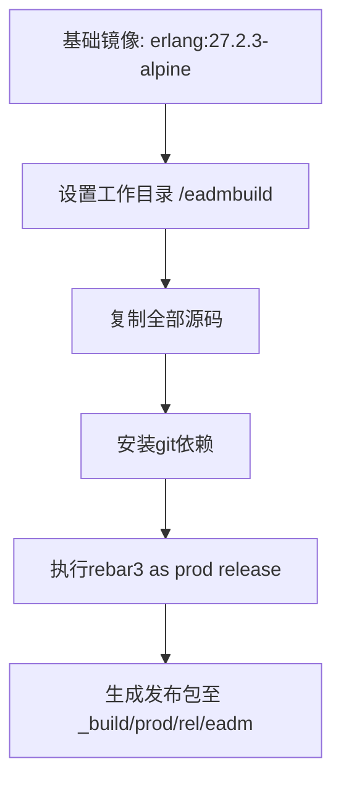
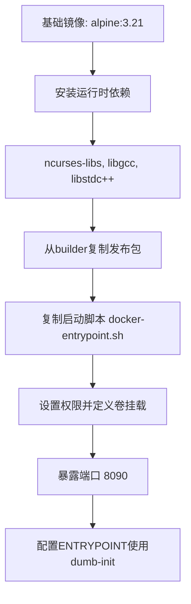
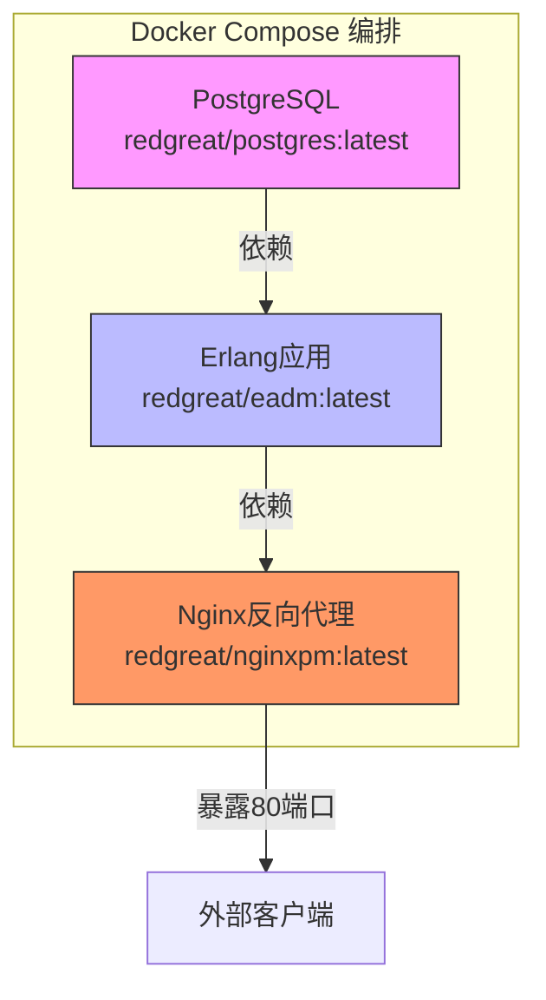
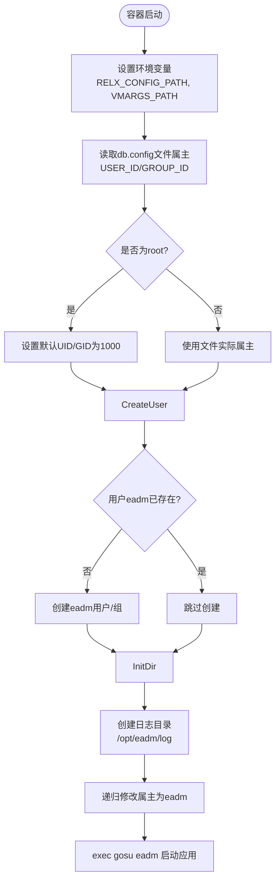

# Docker部署配置

<cite>
**本文档引用的文件**  
- [Dockerfile](file://Dockerfile)
- [docker-compose.yml](file://docker-compose.yml)
- [docker/docker-entrypoint.sh](file://docker/docker-entrypoint.sh)
- [README.Docker.md](file://README.Docker.md)
- [release/dockerbuild.sh](file://release/dockerbuild.sh)
</cite>

## 目录
1. [简介](#简介)
2. [项目结构](#项目结构)
3. [Dockerfile多阶段构建分析](#dockerfile多阶段构建分析)
4. [docker-compose.yml服务编排解析](#docker-composeyml服务编排解析)
5. [docker-entrypoint.sh启动脚本详解](#docker-entrypointsh启动脚本详解)
6. [部署与运行示例](#部署与运行示例)
7. [环境变量说明](#环境变量说明)
8. [常见问题排查指南](#常见问题排查指南)
9. [结论](#结论)

## 简介
本项目采用Docker容器化技术实现Erlang应用的部署，通过多阶段构建生成轻量级Alpine镜像，并利用Docker Compose进行多服务编排。系统由Erlang应用（eadm）、PostgreSQL数据库和Nginx反向代理（npm）组成，具备完整的生产级部署能力。本文档详细解析其Docker配置机制，涵盖镜像构建、服务依赖、权限控制及运行时优化等核心环节。

## 项目结构
项目根目录包含Docker相关配置文件及应用源码，主要结构如下：
- `Dockerfile`：定义多阶段镜像构建流程
- `docker-compose.yml`：声明多容器服务编排
- `docker/`：存放启动脚本和配置模板
- `src/`：Erlang应用源代码
- `script/`：数据库初始化脚本
- `release/`：发布构建脚本

**Section sources**
- [Dockerfile](file://Dockerfile#L1-L42)
- [docker-compose.yml](file://docker-compose.yml#L1-L58)
- [docker/docker-entrypoint.sh](file://docker/docker-entrypoint.sh#L1-L30)

## Dockerfile多阶段构建分析
Dockerfile采用多阶段构建策略，分为编译阶段和运行阶段，确保最终镜像精简且安全。

### 编译阶段（builder）


该阶段基于Erlang官方Alpine镜像，安装必要的构建工具并执行`rebar3`发布命令，完成Erlang应用的编译与打包。

### 运行阶段（runtime）


运行阶段使用最小化的Alpine镜像，仅安装必要运行库（如`ncurses-libs`用于终端支持），并通过`--from=builder`复制编译产物，显著减小镜像体积。

### 关键特性
- **多平台构建支持**：使用`--platform=$BUILDPLATFORM`确保跨平台兼容性
- **安全启动机制**：通过`dumb-init`作为PID 1进程，正确处理信号传递
- **元数据标注**：通过`LABEL`指令添加版本、维护者等信息
- **非root用户运行**：结合`gosu`实现安全降权

**Diagram sources**
- [Dockerfile](file://Dockerfile#L1-L42)

**Section sources**
- [Dockerfile](file://Dockerfile#L1-L42)
- [release/dockerbuild.sh](file://release/dockerbuild.sh#L1-L26)

## docker-compose.yml服务编排解析
`docker-compose.yml`定义了三个核心服务：数据库、应用和反向代理，形成完整的运行环境。



**Diagram sources**
- [docker-compose.yml](file://docker-compose.yml#L1-L58)

### 服务配置详解

#### PostgreSQL数据库服务
- **镜像**：`redgreat/postgres:latest`
- **数据持久化**：通过命名卷`pgdata`挂载至`/var/lib/postgresql/data`
- **端口映射**：宿主机5432 → 容器5432
- **环境变量**：预设用户、数据库名和密码，采用`trust`认证模式简化开发配置

#### Erlang应用服务（eadm）
- **镜像**：`redgreat/eadm:latest`
- **端口映射**：宿主机8080 → 容器8090
- **配置挂载**：
  - `./docker/db.config` → `/opt/eadm/config/db.config`
  - `./docker/sys.config.src` → `/opt/eadm/config/sys.config.src`
  - `./docker/vm.args.src` → `/opt/eadm/config/vm.args.src`
- **日志持久化**：`./logs/` → `/opt/eadm/log/`（读写权限）
- **资源限制**：
  - 内存上限：1G
  - 内存预留：500M
  - 禁用OOM Killer
  - 设置`mem_swappiness=0`减少交换

#### Nginx反向代理服务（npm）
- **镜像**：`redgreat/nginxpm:latest`
- **端口映射**：
  - 80 → 8080（HTTP）
  - 8181 → 8181（管理端口）
  - 443 → 4443（HTTPS）
- **配置持久化**：`./npmdata` → `/config`（读写权限）
- **环境变量**：时区、语言、IPv6控制

### 服务依赖关系

服务启动顺序受`depends_on`控制：PostgreSQL → eadm → npm，确保依赖服务就绪后再启动上游服务。

**Section sources**
- [docker-compose.yml](file://docker-compose.yml#L1-L58)
- [README.Docker.md](file://README.Docker.md#L1-L31)

## docker-entrypoint.sh启动脚本详解
该脚本在容器初始化时执行，负责用户权限适配、目录初始化和安全降权。



**Diagram sources**
- [docker/docker-entrypoint.sh](file://docker/docker-entrypoint.sh#L1-L30)

### 核心功能
1. **动态用户创建**：根据挂载配置文件的属主动态创建`eadm`用户，避免权限冲突
2. **安全降权**：使用`gosu`以非root用户身份执行应用进程，提升安全性
3. **环境变量导出**：设置`RELX_CONFIG_PATH`和`VMARGS_PATH`供Erlang运行时使用
4. **日志目录初始化**：确保日志路径存在并具有正确权限

**Section sources**
- [docker/docker-entrypoint.sh](file://docker/docker-entrypoint.sh#L1-L30)

## 部署与运行示例
可通过以下命令快速启动完整系统：

```bash
docker-compose up -d
```

该命令将：
1. 拉取所需镜像（若本地不存在）
2. 按依赖顺序启动PostgreSQL、eadm和npm容器
3. 应用配置的资源限制和卷挂载策略

验证服务状态：
```bash
docker-compose ps
docker logs eadm
```

访问系统：
- Web界面：`http://localhost`（经Nginx代理）
- 应用直连：`http://localhost:8080`
- PostgreSQL：`localhost:5432`（用户名：user_eadm，密码：iyS62bvt）

**Section sources**
- [docker-compose.yml](file://docker-compose.yml#L1-L58)
- [README.Docker.md](file://README.Docker.md#L1-L31)

## 环境变量说明
| 环境变量 | 服务 | 功能说明 |
|---------|------|---------|
| `DISABLE_IPV6` | eadm, npm | 禁用IPv6支持，避免网络兼容性问题 |
| `TZ` | npm | 设置容器时区为`Asia/Shanghai` |
| `LANG` | npm | 设置语言环境为中文UTF-8 |
| `POSTGRES_USER` | postgres | PostgreSQL默认用户 |
| `POSTGRES_DB` | postgres | 初始化数据库名称 |
| `POSTGRES_PASSWORD` | postgres | 数据库用户密码 |
| `POSTGRES_HOST_AUTH_METHOD` | postgres | 认证方式设为`trust`，免密码登录 |

**Section sources**
- [docker-compose.yml](file://docker-compose.yml#L1-L58)

## 常见问题排查指南
### 权限拒绝（Permission Denied）
**现象**：容器启动失败，日志提示文件或目录权限错误  
**原因**：宿主机挂载文件/目录权限与容器内用户不匹配  
**解决方案**：
1. 确保`./docker/db.config`等配置文件由非root用户拥有
2. 或手动创建`eadm`用户并设置UID/GID一致：
   ```bash
   sudo chown 1000:1000 ./docker/db.config
   ```

### 数据库连接失败
**现象**：eadm服务日志显示无法连接PostgreSQL  
**原因**：服务启动顺序不当或网络配置错误  
**解决方案**：
1. 检查`depends_on`是否正确配置
2. 验证`db.config`中数据库地址是否为`postgres`（Docker内部服务名）
3. 查看PostgreSQL容器日志确认服务正常运行

### 日志未持久化
**现象**：重启容器后日志丢失  
**原因**：`./logs/`目录权限不足或路径错误  
**解决方案**：
1. 确保宿主机`./logs/`目录存在且可写
2. 检查Docker运行用户是否有目录写权限

### 内存溢出（OOM）
**现象**：eadm容器被系统终止  
**原因**：内存使用超过限制  
**解决方案**：
1. 调整`docker-compose.yml`中`deploy.resources.limits.memory`
2. 优化Erlang应用内存使用，检查是否存在内存泄漏

**Section sources**
- [docker-compose.yml](file://docker-compose.yml#L1-L58)
- [docker/docker-entrypoint.sh](file://docker/docker-entrypoint.sh#L1-L30)

## 结论
本项目的Docker部署方案设计严谨，具备以下优势：
- **高效构建**：多阶段构建确保镜像轻量化
- **安全运行**：非root用户+`gosu`降权机制
- **完整编排**：Docker Compose实现服务依赖与资源管理
- **易于维护**：配置与数据持久化分离，便于升级与备份

通过合理配置环境变量、卷挂载和资源限制，可在生产环境中稳定运行。建议在生产部署时替换默认密码、启用SSL加密，并定期备份`pgdata`和`npmdata`卷。