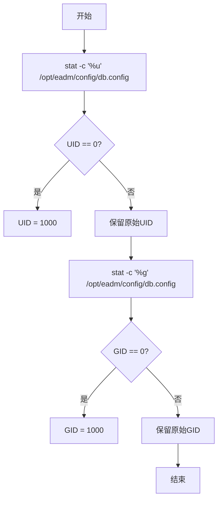

# 容器启动初始化脚本

<cite>
**本文档引用文件**   
- [docker-entrypoint.sh](file://docker/docker-entrypoint.sh)
- [Dockerfile](file://Dockerfile)
- [README.Docker.md](file://README.Docker.md)
</cite>

## 目录
1. [简介](#简介)
2. [项目结构](#项目结构)
3. [核心组件](#核心组件)
4. [架构概述](#架构概述)
5. [详细组件分析](#详细组件分析)
6. [依赖分析](#依赖分析)
7. [性能考虑](#性能考虑)
8. [故障排除指南](#故障排除指南)
9. [结论](#结论)

## 简介
本文档深入分析 `docker/docker-entrypoint.sh` 启动脚本在容器初始化过程中的关键作用。该脚本确保了Erlang应用 `eadm` 在容器环境中以安全、隔离的方式运行。通过读取挂载配置文件的宿主机用户/组ID，动态创建非root用户，并以降权方式执行应用进程，有效避免了以root权限运行带来的安全风险。文档结合 `Dockerfile` 和实际部署场景，全面解析该机制在Kubernetes或生产环境中的安全价值。

## 项目结构
项目采用典型的Erlang/OTP应用结构，结合Docker容器化部署。核心源码位于 `src/` 目录，前端资源位于 `priv/assets/`，数据库脚本位于 `script/`，而容器化相关文件（Dockerfile和启动脚本）位于 `docker/` 目录。`release/` 目录包含构建和发布脚本。这种结构清晰地分离了应用逻辑、配置、资源和部署逻辑。

**Section sources**
- [docker/docker-entrypoint.sh](file://docker/docker-entrypoint.sh#L1-L30)
- [Dockerfile](file://Dockerfile#L1-L42)

## 核心组件
`docker-entrypoint.sh` 是容器生命周期的起点，负责在应用启动前完成关键的初始化和安全配置。其核心功能包括：基于挂载文件的宿主权限动态创建运行用户、确保应用目录的正确属主、以及以非特权用户身份安全地启动Erlang应用。

**Section sources**
- [docker/docker-entrypoint.sh](file://docker/docker-entrypoint.sh#L1-L30)

## 架构概述
该应用采用经典的微服务架构，通过Docker容器进行封装和部署。`Dockerfile` 定义了多阶段构建流程，最终生成一个轻量级的Alpine Linux镜像。`docker-entrypoint.sh` 作为容器的入口点（ENTRYPOINT），在 `dumb-init` 进程管理器的托管下执行，负责初始化环境并以安全的非root用户身份启动Erlang应用。

```mermaid
graph TB
subgraph "构建阶段"
A[erlang:27.2.3-alpine] --> |COPY & RUN rebar3 release| B[构建镜像]
end
subgraph "运行阶段"
C[alpine:3.21] --> |COPY 构建产物| D[运行时镜像]
D --> E[dumb-init]
E --> F[docker-entrypoint.sh]
F --> G[/opt/eadm/bin/eadm foreground]
end
B --> D
```

**Diagram sources **
- [Dockerfile](file://Dockerfile#L1-L42)
- [docker/docker-entrypoint.sh](file://docker/docker-entrypoint.sh#L1-L30)

## 详细组件分析

### 用户与权限安全初始化分析
`docker-entrypoint.sh` 脚本的核心安全机制在于动态用户创建和权限降级。

#### 用户ID/组ID获取与处理
脚本首先使用 `stat -c '%u'` 和 `stat -c '%g'` 命令读取挂载到容器内的配置文件 `/opt/eadm/config/db.config` 的宿主机用户ID（UID）和组ID（GID）。这是实现权限匹配的关键。如果读取到的UID或GID为0（即root），脚本会将其默认设置为1000，以避免在容器内创建root用户，这是一种安全最佳实践。



**Diagram sources **
- [docker/docker-entrypoint.sh](file://docker/docker-entrypoint.sh#L10-L13)

#### 动态用户创建逻辑
脚本通过 `id "eadm"` 命令检查名为 `eadm` 的用户是否已存在。如果用户不存在，则使用 `addgroup` 和 `adduser` 命令创建该用户和组，并将其UID和GID设置为上一步获取的值。`-S` 参数表示创建系统用户，`-D` 表示不为用户创建主目录。此逻辑确保了用户仅在首次初始化时创建，避免了重复操作。

**Section sources**
- [docker/docker-entrypoint.sh](file://docker/docker-entrypoint.sh#L15-L23)

#### 日志目录创建与权限设置
脚本创建 `/opt/eadm/log` 目录（如果不存在），并使用 `chown -R eadm:eadm /opt/eadm` 递归地将整个 `/opt/eadm` 目录的所有权赋予 `eadm` 用户和组。这确保了以 `eadm` 用户身份运行的应用程序能够正常读取配置文件并写入日志文件，解决了因权限不足导致的I/O错误。

**Section sources**
- [docker/docker-entrypoint.sh](file://docker/docker-entrypoint.sh#L26)

#### 安全降权执行应用
脚本的最后一行是 `exec /usr/bin/gosu eadm /opt/eadm/bin/eadm foreground`。`gosu` 是一个轻量级的 `sudo` 替代工具，用于以指定用户身份执行命令。`exec` 命令会替换当前shell进程，使得Erlang应用成为容器内的主进程（PID 1）。这种方式以 `eadm` 用户身份安全地启动应用，完全避免了应用进程以root权限运行，极大地提升了容器的安全性。

**Section sources**
- [docker/docker-entrypoint.sh](file://docker/docker-entrypoint.sh#L29)

## 依赖分析
该脚本依赖于Alpine Linux的 `shadow` 工具包（提供 `addgroup` 和 `adduser` 命令）以及 `gosu` 工具。这些依赖在 `Dockerfile` 中通过 `apk add` 命令明确声明和安装，确保了脚本在运行时环境中的可执行性。

**Section sources**
- [Dockerfile](file://Dockerfile#L15-L16)

## 性能考虑
此初始化脚本对性能的影响微乎其微。它仅在容器启动时执行一次，所涉及的文件系统操作（读取stat信息、创建用户、修改属主）都是轻量级的，不会对应用的常规运行性能造成任何影响。

## 故障排除指南
若应用启动失败，应首先检查 `docker-entrypoint.sh` 的执行日志（因 `set -x` 已启用，会输出详细执行过程）。常见问题包括：`db.config` 文件未正确挂载导致 `stat` 命令失败；`gosu` 命令未找到（检查Dockerfile是否正确安装）；或 `chown` 命令因权限问题失败（确保挂载卷的宿主机目录权限允许修改）。

**Section sources**
- [docker/docker-entrypoint.sh](file://docker/docker-entrypoint.sh#L1-L30)

## 结论
`docker-entrypoint.sh` 脚本是 `eadm` 应用容器化部署中的安全基石。它通过精巧的设计，实现了从宿主机权限到容器内运行用户的无缝、安全映射。该机制不仅遵循了“最小权限原则”，防止了root权限滥用，还通过 `gosu` 实现了安全的权限降级。在Kubernetes等生产环境中，这种做法是保障容器安全性的标准实践，有效降低了因应用漏洞导致的系统级风险。