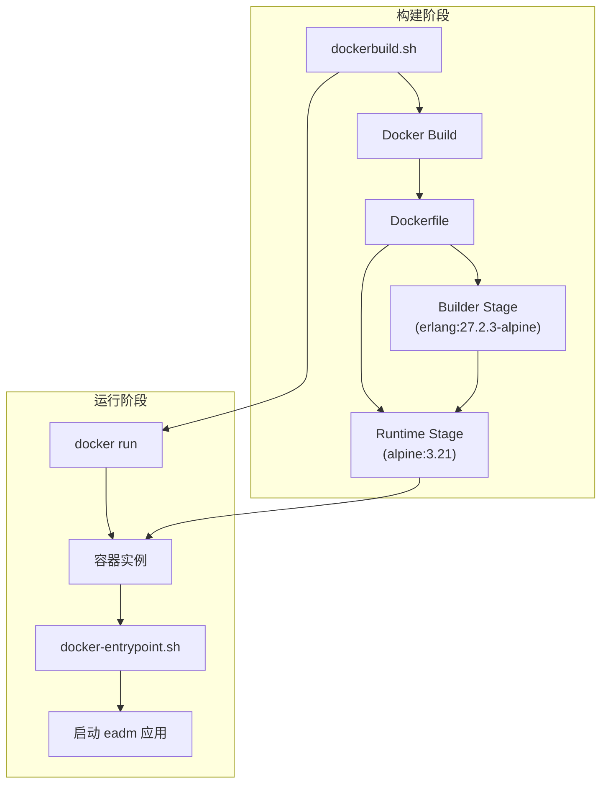
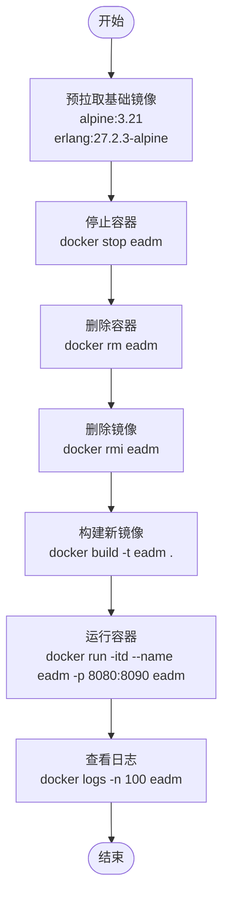
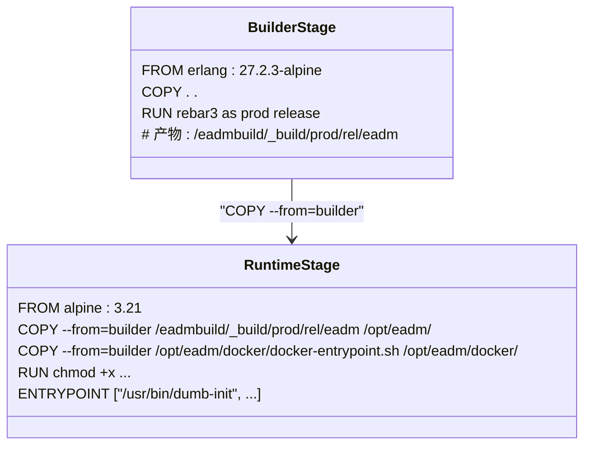
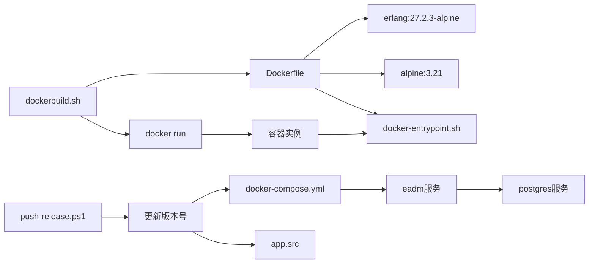

# Docker构建脚本详解

<cite>
**本文档引用文件**  
- [dockerbuild.sh](file://release/dockerbuild.sh)
- [Dockerfile](file://Dockerfile)
- [docker-entrypoint.sh](file://docker/docker-entrypoint.sh)
- [README.Docker.md](file://README.Docker.md)
- [docker-compose.yml](file://docker-compose.yml)
</cite>

## 目录
1. [简介](#简介)
2. [项目结构](#项目结构)
3. [核心组件](#核心组件)
4. [架构概述](#架构概述)
5. [详细组件分析](#详细组件分析)
6. [依赖分析](#依赖分析)
7. [性能考量](#性能考量)
8. [故障排除指南](#故障排除指南)
9. [结论](#结论)

## 简介
本文档深入解析 `release/dockerbuild.sh` Shell 脚本的完整执行流程与设计逻辑。该脚本是 eadm 项目自动化构建的核心工具，负责从源码到可运行容器的全过程。脚本通过预拉取基础镜像、清理旧环境、构建新镜像并运行验证，实现可重复、可追溯的构建过程。文档将详细说明各阶段作用、参数策略，并提供常见问题的解决方案与最佳实践。

## 项目结构
`dockerbuild.sh` 脚本位于 `release/` 目录下，与根目录的 `Dockerfile` 协同工作。项目采用多阶段 Docker 构建策略，前端资源位于 `priv/assets`，Erlang 源码位于 `src/`，数据库脚本分散在 `script/` 的各子目录中。`docker/` 目录存放容器入口脚本，`docker-compose.yml` 定义了完整的多容器服务栈。

**Section sources**
- [dockerbuild.sh](file://release/dockerbuild.sh#L0-L26)
- [Dockerfile](file://Dockerfile#L0-L41)
- [docker-compose.yml](file://docker-compose.yml#L0-L57)

## 核心组件
`dockerbuild.sh` 是构建流程的控制中心，其核心功能包括：预拉取 `erlang:27.2.3-alpine` 和 `alpine:3.21` 基础镜像以加速后续构建；清理名为 `eadm` 的旧容器和镜像，确保构建环境纯净；执行 `docker build` 命令构建新镜像；启动容器进行功能验证，并输出日志。该脚本与 `Dockerfile` 定义的多阶段构建过程紧密配合，实现了从源码到生产就绪镜像的自动化。

**Section sources**
- [dockerbuild.sh](file://release/dockerbuild.sh#L0-L26)
- [Dockerfile](file://Dockerfile#L0-L41)

## 架构概述
整个构建流程遵循典型的 CI/CD 实践。`dockerbuild.sh` 作为顶层构建脚本，调用 Docker 引擎执行 `Dockerfile` 中定义的指令。`Dockerfile` 采用多阶段构建，第一阶段使用 `erlang:27.2.3-alpine` 镜像编译 Erlang 应用，第二阶段使用更轻量的 `alpine:3.21` 镜像作为运行时环境，仅复制编译产物和必要的运行时依赖。`docker-entrypoint.sh` 脚本在容器启动时负责用户和权限初始化，确保应用以非 root 用户安全运行。

**Diagram sources**
- [dockerbuild.sh](file://release/dockerbuild.sh#L0-L26)
- [Dockerfile](file://Dockerfile#L0-L41)
- [docker-entrypoint.sh](file://docker/docker-entrypoint.sh#L0-L30)

## 详细组件分析

### dockerbuild.sh 脚本分析
`dockerbuild.sh` 脚本定义了构建流水线的各个步骤。其设计逻辑清晰，分为准备、清理、构建、运行和验证四个阶段。

#### 准备与清理阶段
脚本首先预拉取两个基础镜像 `alpine:3.21` 和 `erlang:27.2.3-alpine`。此操作在反复打包测试时能显著节省时间，避免了每次构建都从远程仓库下载镜像的网络开销。随后，脚本尝试停止、删除名为 `eadm` 的旧容器（`docker stop` 和 `docker rm`），并删除同名的旧镜像（`docker rmi`）。这一系列清理操作确保了构建环境的纯净，避免了旧的运行实例或镜像对新构建造成干扰。

**Diagram sources**
- [dockerbuild.sh](file://release/dockerbuild.sh#L0-L26)

**Section sources**
- [dockerbuild.sh](file://release/dockerbuild.sh#L0-L26)

#### 构建与运行阶段
脚本的核心是 `docker build -t eadm .` 命令。它使用当前目录（`.`）作为构建上下文，根据 `Dockerfile` 的指令构建镜像，并将其标记（`-t`）为 `eadm`。脚本中注释掉的 `--no-cache` 选项表明，开发者可以根据需要选择是否禁用构建缓存。启用缓存可以加速构建，但可能因缓存导致旧代码被使用；禁用缓存则确保每次都从头构建，保证了结果的纯净。构建完成后，脚本立即使用 `docker run` 命令启动一个名为 `eadm` 的守护式容器（`-itd`），并将主机的 `8080` 端口映射到容器的 `8090` 端口（`-p 8080:8090`），这是访问应用的标准方式。最后，`docker logs -n 100 eadm` 命令输出容器的最后100行日志，用于快速验证应用是否成功启动。

**Section sources**
- [dockerbuild.sh](file://release/dockerbuild.sh#L0-L26)
- [README.Docker.md](file://README.Docker.md#L16-L31)

### Dockerfile 构建逻辑分析
`Dockerfile` 采用多阶段构建（multi-stage build）以优化最终镜像的大小和安全性。

#### 构建者阶段 (Builder Stage)
第一阶段以 `erlang:27.2.3-alpine` 为基础镜像，该镜像包含了编译 Erlang 应用所需的所有工具链（如 Erlang/OTP、rebar3）。脚本将整个项目目录复制到工作目录 `/eadmbuild`，然后安装 `git` 并执行 `rebar3 as prod release` 命令来编译和打包应用。此阶段生成的产物（位于 `_build/prod/rel/eadm`）包含了可执行的二进制文件和所有依赖。

#### 运行时阶段 (Runtime Stage)
第二阶段从一个极小的 `alpine:3.21` 镜像开始，这大大减小了最终镜像的体积。它只安装了运行 Erlang 应用所必需的库（`ncurses-libs`, `libgcc`, `libstdc++`）和工具（`dumb-init` 用于进程管理，`gosu` 用于权限切换）。关键的 `COPY --from=builder` 指令将第一阶段构建好的应用和 `docker-entrypoint.sh` 脚本复制到 `/opt/eadm` 目录。`ENTRYPOINT` 指令配置了容器的启动命令，使用 `dumb-init` 来启动 `docker-entrypoint.sh`，后者负责最终的用户初始化和应用启动。

**Diagram sources**
- [Dockerfile](file://Dockerfile#L0-L41)
- [docker-entrypoint.sh](file://docker/docker-entrypoint.sh#L0-L30)

**Section sources**
- [Dockerfile](file://Dockerfile#L0-L41)

### docker-entrypoint.sh 入口脚本分析
该脚本是容器启动时执行的第一个程序，负责运行时的初始化工作。

#### 用户与权限管理
脚本通过读取挂载的配置文件（如 `db.config`）的文件系统权限，动态确定应用运行的用户ID（`USER_ID`）和组ID（`GROUP_ID`）。如果这些ID为0（即root），则默认使用1000。脚本会检查 `eadm` 用户是否存在，若不存在则创建该用户和组。这种设计使得容器内的应用可以以与宿主机文件权限匹配的用户身份运行，增强了安全性。

#### 应用启动
脚本创建必要的日志目录并设置正确的所有权，最后使用 `gosu` 切换到 `eadm` 用户，并以 `foreground` 模式启动 `eadm` 应用。`dumb-init` 作为 `ENTRYPOINT`，可以正确处理信号（如SIGTERM），确保应用能够优雅地关闭。

**Section sources**
- [docker-entrypoint.sh](file://docker/docker-entrypoint.sh#L0-L30)

## 依赖分析
`dockerbuild.sh` 脚本的执行依赖于多个组件。它直接依赖于 `Dockerfile` 来定义镜像构建过程，并依赖于 `docker-entrypoint.sh` 脚本在容器内执行初始化。`Dockerfile` 本身依赖于 `erlang:27.2.3-alpine` 和 `alpine:3.21` 这两个基础镜像。在运行时，`docker-compose.yml` 文件定义了 `eadm` 服务与 `postgres` 数据库服务的依赖关系，确保数据库先于应用启动。此外，`push-release.ps1` 脚本在发布新版本时会更新 `app.src` 和 `docker-compose.yml` 中的版本号，与构建流程间接关联。

**Diagram sources**
- [dockerbuild.sh](file://release/dockerbuild.sh#L0-L26)
- [Dockerfile](file://Dockerfile#L0-L41)
- [docker-entrypoint.sh](file://docker/docker-entrypoint.sh#L0-L30)
- [docker-compose.yml](file://docker-compose.yml#L0-L57)
- [push-release.ps1](file://release/push-release.ps1#L24-L48)

**Section sources**
- [dockerbuild.sh](file://release/dockerbuild.sh#L0-L26)
- [Dockerfile](file://Dockerfile#L0-L41)
- [docker-compose.yml](file://docker-compose.yml#L0-L57)

## 性能考量
`dockerbuild.sh` 脚本的设计充分考虑了构建效率。预拉取基础镜像避免了网络延迟，是提升反复构建速度的关键。多阶段构建显著减小了最终镜像的大小，加快了镜像的推送和拉取速度。然而，脚本默认启用了构建缓存，虽然这能加速构建，但在某些情况下可能导致构建结果不一致。在CI/CD环境中，为了保证构建的可重复性，建议在 `docker build` 命令中加入 `--no-cache` 选项。此外，`docker-compose.yml` 中定义的内存和CPU限制（如 `1G` 内存限制）有助于防止应用占用过多资源，保证了生产环境的稳定性。

## 故障排除指南
在使用 `dockerbuild.sh` 时，可能会遇到以下常见问题：

**Section sources**
- [dockerbuild.sh](file://release/dockerbuild.sh#L0-L26)
- [README.Docker.md](file://README.Docker.md#L16-L31)
- [docker-entrypoint.sh](file://docker/docker-entrypoint.sh#L0-L30)

### 构建失败
*   **问题**: `docker build` 命令失败。
*   **排查**: 检查 `Dockerfile` 中的 `RUN rebar3 as prod release` 是否成功。确保 `rebar3` 能够正确下载依赖。查看构建日志中的具体错误信息，常见问题包括网络问题导致依赖下载失败，或源码中存在编译错误。

### 镜像拉取超时
*   **问题**: `docker pull` 命令超时。
*   **解决方案**: 配置 Docker 的镜像加速器（如国内的阿里云镜像服务），以解决访问 Docker Hub 缓慢的问题。

### 权限不足
*   **问题**: 容器启动后因权限问题无法写入文件或访问端口。
*   **排查**: 检查 `docker-entrypoint.sh` 脚本。确保挂载的配置文件（如 `db.config`）在宿主机上有正确的读写权限。脚本会根据这些文件的权限创建用户，如果权限设置不当，可能导致应用无法正常运行。

### 端口冲突
*   **问题**: `docker run` 时提示端口已被占用。
*   **解决方案**: 使用 `docker ps` 查看正在运行的容器，确认是否有其他容器占用了 `8080` 端口。可以停止冲突的容器，或修改 `dockerbuild.sh` 中的 `-p 8080:8090` 参数，将主机端口映射到其他端口（如 `-p 8081:8090`）。

## 结论
`release/dockerbuild.sh` 脚本是一个设计精良的自动化构建工具，它与 `Dockerfile` 和 `docker-entrypoint.sh` 等组件协同工作，实现了 eadm 项目从源码到容器化部署的完整流程。脚本通过预拉取、清理、构建、运行和日志查看等步骤，确保了构建过程的可重复性和可追溯性。其采用的多阶段构建和动态用户管理策略，兼顾了构建效率、镜像大小和运行时安全性。通过理解其工作原理和潜在问题，开发者可以更高效地进行开发、测试和部署。