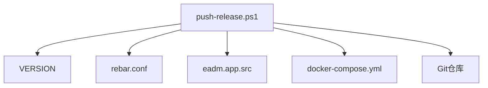

# 发布推送脚本详解

<cite>
**本文档引用的文件**  
- [push-release.ps1](file://release/push-release.ps1)
- [VERSION](file://VERSION)
- [eadm.app.src](file://src/eadm.app.src)
- [docker-compose.yml](file://docker-compose.yml)
</cite>

## 目录
1. [简介](#简介)
2. [项目结构](#项目结构)
3. [核心组件](#核心组件)
4. [自动化发布机制详解](#自动化发布机制详解)
5. [版本检测与验证逻辑](#版本检测与验证逻辑)
6. [多文件版本号同步更新](#多文件版本号同步更新)
7. [Git标签创建与推送](#git标签创建与推送)
8. [Git配置优化与自动化兼容性](#git配置优化与自动化兼容性)
9. [执行输出与场景分析](#执行输出与场景分析)
10. [故障诊断与恢复指南](#故障诊断与恢复指南)

## 简介
本文档深入剖析 `release/push-release.ps1` 脚本在Windows平台下的自动化发布机制。该脚本通过Git命令与PowerShell脚本能力，实现基于版本文件变更的智能发布流程。文档将详细解释其触发条件、版本验证、多文件同步、标签管理及远程推送等关键环节，并提供常见问题的应对策略。

## 项目结构
`push-release.ps1` 位于 `release/` 目录下，是整个项目自动化发布的核心脚本。其作用范围涉及多个关键配置文件，包括根目录下的 `VERSION`、`rebar.conf`、`src/eadm.app.src` 和 `docker-compose.yml`。这些文件共同定义了项目的版本标识与部署配置。

**图示来源**  
- [push-release.ps1](file://release/push-release.ps1#L1-L50)
- [VERSION](file://VERSION#L1-L2)
- [rebar.conf](file://rebar.config/rebar.config)
- [eadm.app.src](file://src/eadm.app.src#L1-L25)
- [docker-compose.yml](file://docker-compose.yml#L1-L59)

## 核心组件
该脚本依赖于PowerShell运行时环境与本地Git命令行工具，通过调用 `git rev-parse`、`git diff-tree`、`git show`、`git tag` 和 `git push` 等命令实现自动化操作。其核心逻辑围绕 `VERSION` 文件的变更检测与版本号比较展开。

**本节来源**  
- [push-release.ps1](file://release/push-release.ps1#L1-L50)

## 自动化发布机制详解
脚本的执行流程始于获取当前提交的哈希值（`git rev-parse HEAD`），随后检查该提交是否包含对 `VERSION` 文件的修改（`git diff-tree --name-only -r`）。只有当 `VERSION` 被修改时，才会触发后续的发布流程。

此机制确保了发布行为仅在版本号更新时发生，避免了不必要的标签创建与推送操作，提升了发布流程的精准性与可控性。

**本节来源**  
- [push-release.ps1](file://release/push-release.ps1#L3-L7)

## 版本检测与验证逻辑
当检测到 `VERSION` 文件被修改后，脚本会通过 `Invoke-WebRequest` 获取远程 `main` 分支上 `VERSION` 文件的当前内容，并与本地提交中的 `VERSION` 内容（`git show HEAD:VERSION`）进行比较。

若两者内容一致，则说明版本未实际更新，脚本终止并输出提示信息。若本地版本内容大于远程版本内容（字符串比较），则认为版本号递增，允许继续发布流程；否则，若本地版本小于或等于远程版本，脚本将拒绝发布，防止版本倒退或重复发布。

**本节来源**  
- [push-release.ps1](file://release/push-release.ps1#L9-L18)

## 多文件版本号同步更新
在确认版本更新有效后，脚本会使用正则表达式自动更新项目中多个关键文件内的版本号：

- **rebar.conf**：更新 `{release, {eadm, "X.X.X"}}` 和 `releases/X.X.X/prod_db.config` 中的版本号。
- **eadm.app.src**：更新 `{vsn, "X.X.X"}` 中的应用版本号。
- **docker-compose.yml**：更新镜像路径中 `releases/X.X.X/` 的版本号。

正则表达式采用**前瞻断言**（`(?<=...)`）和**后瞻断言**（`(?=...)`）确保仅替换目标版本号，而不影响文件结构或其他内容，保证了替换的精确性与安全性。

**本节来源**  
- [push-release.ps1](file://release/push-release.ps1#L20-L37)
- [eadm.app.src](file://src/eadm.app.src#L2)
- [docker-compose.yml](file://docker-compose.yml#L22)

## Git标签创建与推送
版本号同步完成后，脚本会基于新的版本号创建Git标签（格式为 `vX.X.X`），并使用 `git tag` 命令将其绑定到当前提交哈希上。

随后，脚本通过 `git push --tags` 命令将本地提交和新创建的标签一并推送到远程仓库的 `main` 分支。此操作确保了版本标签与代码提交的原子性同步，便于后续的版本追溯与部署。

**本节来源**  
- [push-release.ps1](file://release/push-release.ps1#L39-L42)

## Git配置优化与自动化兼容性
脚本在执行 `git tag` 和 `git push` 时，显式禁用了凭证助手（`credential.helper=`）、关闭了路径引号转义（`core.quotepath=false`）并隐藏了签名信息（`log.showSignature=false`）。

这些配置对于自动化脚本至关重要：
- 禁用凭证助手可防止Git在推送时弹出用户名/密码输入框，避免自动化流程被交互式操作阻塞。
- 关闭路径引号转义确保中文或特殊字符路径的兼容性。
- 隐藏签名信息简化输出，避免不必要的日志干扰。

**本节来源**  
- [push-release.ps1](file://release/push-release.ps1#L39-L42)

## 执行输出与场景分析
脚本在不同场景下会产生明确的输出信息，便于用户判断执行结果：

- **未提交版本更新**：输出红色提示“未提交版本更新...”，表示 `VERSION` 文件未被修改。
- **版本一致**：输出“本地版本号与远程版本一致，版本未更新...”，防止重复发布。
- **版本倒退**：输出“本地版本号小于远程版本号，无法进行版本更新...”，防止非法版本操作。
- **发布成功**：无显式成功输出，但Git推送过程会显示进度（`--progress`），可通过Git命令验证标签与提交。

**本节来源**  
- [push-release.ps1](file://release/push-release.ps1#L10-L12)
- [push-release.ps1](file://release/push-release.ps1#L14-L16)
- [push-release.ps1](file://release/push-release.ps1#L18-L19)
- [push-release.ps1](file://release/push-release.ps1#L42)

## 故障诊断与恢复指南
### 常见问题与解决方案

| 问题现象 | 可能原因 | 解决方案 |
|--------|--------|--------|
| 推送被挂起或要求输入凭据 | 凭证助手未正确禁用或Git配置问题 | 确保使用 `git -c credential.helper=` 参数；检查本地Git凭据管理器设置 |
| 网络连接超时 | 网络不稳定或远程仓库不可达 | 检查网络连接，重试脚本；确认 `RemoteRepoUrl` 地址正确 |
| 版本号未更新但脚本执行失败 | 正则表达式匹配失败或文件路径错误 | 检查 `rebar.conf`、`eadm.app.src`、`docker-compose.yml` 文件路径与格式是否符合预期 |
| 标签已创建但未推送 | `git push` 命令中断 | 手动执行 `git push origin main --tags` 补推标签 |
| 版本号比较异常 | `VERSION` 文件包含空格或换行符 | 使用 `.Trim()` 方法清理内容，脚本中已处理 |

### 恢复步骤
1. 检查本地 `VERSION` 文件内容是否正确。
2. 确认远程仓库 `main` 分支的 `VERSION` 内容。
3. 若标签已创建但未推送，手动执行推送命令。
4. 若版本号错误，修正 `VERSION` 文件并重新提交，再次运行脚本。
5. 若问题持续，检查Git环境与网络配置。

**本节来源**  
- [push-release.ps1](file://release/push-release.ps1#L1-L50)
- [VERSION](file://VERSION#L1-L2)