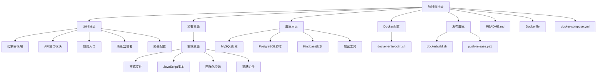

# 项目目录结构详解

<cite>
**本文档中引用的文件**  
- [README.md](file://README.md)
- [eadm_router.erl](file://src/eadm_router.erl)
- [eadm_app.erl](file://src/eadm_app.erl)
- [eadm_sup.erl](file://src/eadm_sup.erl)
- [Dockerfile](file://Dockerfile)
- [docker-compose.yml](file://docker-compose.yml)
- [dockerbuild.sh](file://release/dockerbuild.sh)
- [docker-entrypoint.sh](file://docker/docker-entrypoint.sh)
- [sec.erl](file://script/sec.erl)
- [login.js](file://priv/assets/js/login.js)
- [i18n-user.js](file://priv/assets/i18n/i18n-user.js)
- [DataStruct.sql](file://script/mysql/DataStruct.sql)
- [datastruct.sql](file://script/postgres/datastruct.sql)
- [datastruct.sql](file://script/kingbase/datastruct.sql)
</cite>

## 目录结构

本项目采用典型的 Erlang/OTP 应用结构，结合前后端分离与多数据库支持的设计。整体目录结构清晰，职责分明，便于开发、构建与部署。

**Diagram sources**  
- [README.md](file://README.md)
- [project_structure](file://project_structure)

## 源码目录（src/）

`src/` 目录存放所有 Erlang 源码，遵循 OTP 应用规范，包含控制器、API 接口、核心服务模块等。

### 控制器模块（controllers/）

位于 `src/controllers/`，负责处理 HTTP 请求，实现业务逻辑。每个控制器对应一个前端功能模块，如用户、角色、设备、健康数据等。

控制器通过 `eadm_router.erl` 中定义的路由进行绑定，例如：

- `eadm_user_controller.erl`：处理用户管理相关请求（增删改查、权限分配）
- `eadm_role_controller.erl`：处理角色管理
- `eadm_device_controller.erl`：处理设备分配与状态管理
- `eadm_dashboard_controller.erl`：处理首页数据展示
- `eadm_login_controller.erl`：处理用户登录、登出、密码修改等认证逻辑

这些控制器通过调用数据库模块（如 `eadm_pgpool`）与数据库交互，并返回 JSON 响应或重定向。

**Section sources**  
- [eadm_router.erl](file://src/eadm_router.erl#L1-L164)
- [eadm_login_controller.erl](file://src/controllers/eadm_login_controller.erl#L1-L244)

### API 接口模块（apis/）

位于 `src/apis/`，提供无需认证或特定认证的 API 接口，供外部系统调用。

- `api_watch.erl`：接收智能手表上报的数据（如心率、步数、定位、报警等），并写入数据库。该接口无需登录认证，通过 POST 请求接收数据。
- `api_payment.erl`：可能用于支付相关接口（当前未详细分析）。

这些 API 模块通常作为系统集成点，接收来自设备或其他服务的数据。

**Section sources**  
- [eadm_router.erl](file://src/eadm_router.erl#L150-L155)
- [api_watch.erl](file://src/apis/api_watch.erl#L1-L496)

### 核心服务模块

除控制器外，`src/` 下还包含多个核心服务模块，实现系统关键功能：

- `eadm_app.erl`：应用启动入口，实现 `application` 行为。在启动时初始化日志、启动监督者，并设置定时任务。
- `eadm_sup.erl`：顶级监督者，实现 `supervisor` 行为。负责启动和监控子进程，如数据库连接池。
- `eadm_router.erl`：定义所有 HTTP 路由规则，将 URL 映射到对应的控制器函数。
- `eadm_auth.erl`：实现认证逻辑，检查用户会话是否有效，是权限控制的核心。
- `eadm_utils.erl`：提供通用工具函数，如密码加密、JSON 转换、数据库结果处理、时间格式化等。
- `eadm_pgpool.erl` 和 `eadm_pgpool_worker.erl`：封装 PostgreSQL 数据库连接池操作，提供同步和异步查询接口。
- 其他模块如 `eadm_geo`（地理相关）、`eadm_push`（消息推送）、`eadm_wechat`（微信集成）等，实现特定业务功能。

这些模块共同构成了系统的后端服务骨架，确保高可用、可扩展。

**Section sources**  
- [eadm_app.erl](file://src/eadm_app.erl#L1-L55)
- [eadm_sup.erl](file://src/eadm_sup.erl#L1-L61)
- [eadm_auth.erl](file://src/eadm_auth.erl#L1-L48)

## 私有资源目录（priv/assets/）

`priv/assets/` 存放前端静态资源，包括 CSS、JavaScript、国际化文件等，供 Web 服务器直接提供。

### 样式文件（css/）

位于 `priv/assets/css/`，包含多个 CSS 文件，分别对应不同页面或组件的样式：

- `login.css`：登录页面样式
- `dashboard.css`：仪表盘样式
- `table-custom.css`：表格定制样式
- `common-panels.css`：通用面板样式
- `style.css`：全局样式

这些文件通过 HTML 页面引入，控制前端界面的外观。

### JavaScript 脚本（js/）

位于 `priv/assets/js/`，包含前端交互逻辑：

- `login.js`：处理登录表单提交、按钮状态控制、登录成功跳转等。
- `user.js`、`role.js`、`device.js` 等：分别对应用户、角色、设备管理页面的 AJAX 请求与 DOM 操作。
- `dashboard.js`：处理首页数据加载与图表渲染。
- `utils.js`、`basic.js`：提供通用 JavaScript 工具函数。

这些脚本与后端控制器协同工作，实现动态页面。

**Section sources**  
- [login.js](file://priv/assets/js/login.js#L1-L75)

### 国际化资源（i18n/）

位于 `priv/assets/i18n/`，提供多语言支持：

- `i18n-user.js`：定义用户管理模块的字段中文名称，如“用户姓名”、“登录名”、“邮件”等。
- 其他 `i18n-*.js` 文件类似，为不同模块提供语言包。

前端通过加载相应的语言包实现界面文本的国际化。

**Section sources**  
- [i18n-user.js](file://priv/assets/i18n/i18n-user.js#L1-L36)

### 前端组件（components/）

包含可复用的前端 UI 组件样式，如侧边栏（sidebar）、导航栏（navbar）等，便于统一界面风格。

## 脚本目录（script/）

`script/` 目录存放数据库初始化脚本及其他辅助脚本。

### 数据库 SQL 脚本

按数据库类型分目录存放，支持多种数据库：

- `mysql/`：MySQL 数据库脚本
  - `DataStruct.sql`：创建表结构、视图、函数、触发器，并插入初始数据（如租户、用户、角色）。
- `postgres/`：PostgreSQL 脚本
  - `datastruct.sql`：类似 MySQL 脚本，但使用 PostgreSQL 语法（如 `timestamptz`、`lpad`）。
- `kingbase/`：人大金仓数据库脚本
  - `datastruct.sql`：适配 Kingbase 语法的建表脚本。
- 其他目录如 `oracle`、`tidb` 等也提供相应支持。

这些脚本用于初始化数据库，确保系统运行所需的表结构和基础数据。

**Section sources**  
- [DataStruct.sql](file://script/mysql/DataStruct.sql#L1-L356)
- [datastruct.sql](file://script/postgres/datastruct.sql#L1-L799)
- [datastruct.sql](file://script/kingbase/datastruct.sql#L1-L799)

### 其他脚本

- `sec.erl`：Erlang 脚本，用于生成加密密码，可能在初始化用户时使用。

## Docker 配置目录（docker/）

包含 Docker 相关配置文件：

- `docker-entrypoint.sh`：容器启动入口脚本。创建非 root 用户 `eadm`，设置文件权限，并以该用户身份启动应用，提升安全性。
- 该脚本通过 `gosu` 切换用户，确保应用在容器中以普通用户运行。

**Section sources**  
- [docker-entrypoint.sh](file://docker/docker-entrypoint.sh#L1-L30)

## 发布脚本目录（release/）

包含构建和发布相关的脚本：

- `dockerbuild.sh`：Docker 镜像构建脚本。清理旧镜像，调用 `docker build` 构建新镜像，并运行容器。
- `push-release.ps1`：PowerShell 脚本，可能用于推送发布版本（未详细分析内容）。

这些脚本自动化了构建和部署流程。

**Section sources**  
- [dockerbuild.sh](file://release/dockerbuild.sh#L1-L27)

## 开发、构建、部署流程

### 开发流程

1. **前端开发**：在 `priv/assets/` 修改 CSS、JS、i18n 文件，调整界面样式与交互。
2. **后端开发**：在 `src/` 编写或修改 Erlang 模块，实现业务逻辑。
3. **路由配置**：在 `eadm_router.erl` 中添加新的 URL 路由，绑定到控制器函数。
4. **数据库变更**：根据需求修改 `script/` 下对应数据库的 SQL 脚本。

### 构建流程

1. 使用 `rebar3` 工具编译 Erlang 代码，生成发布包。
2. `Dockerfile` 定义了构建过程：基于 Erlang 基础镜像，复制代码，运行 `rebar3 release`，生成可执行镜像。
3. `release/dockerbuild.sh` 脚本封装了 `docker build` 命令，简化构建操作。

### 部署流程

1. 使用 `docker-compose.yml` 定义多服务（PostgreSQL、eadm、NginxPM），通过 `docker-compose up` 一键启动。
2. `docker-entrypoint.sh` 确保应用以安全用户身份运行。
3. 外部通过 `8080` 端口访问服务，请求由 Nginx 反向代理至后端。

该流程实现了从代码到容器化部署的自动化，便于在不同环境快速部署。

**Section sources**  
- [Dockerfile](file://Dockerfile#L1-L42)
- [docker-compose.yml](file://docker-compose.yml#L1-L58)